# soal-shift-sisop-modul-3-F10-2021

<br>

# **Nomor 1**

Untuk menghandle berbagai request dari client, berikut adalah gambaran besar bagaimana server & client berkomunikasi:

### **Inisialisasi koneksi antara server & client**

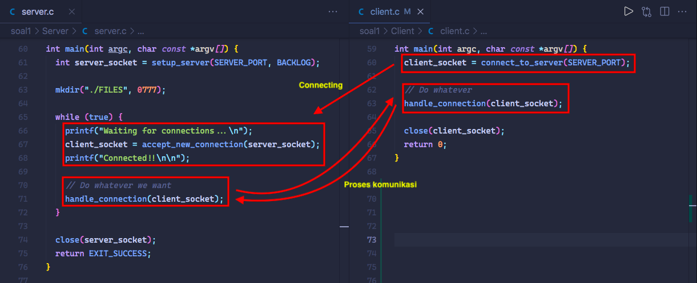

### **Handle request**

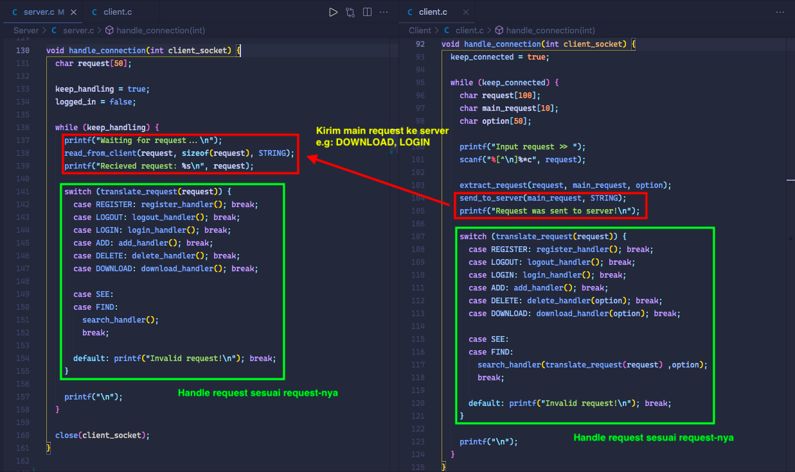

- Disini client akan menginputkan request utamanya, lalu dikirim ke server dan dilakukan _handling request_ sesuai input requestnya.

- Pada client, [`extract_request()`](https://github.com/DewanggaDh/soal-shift-sisop-modul-3-F10-2021/blob/main/soal1/Client/client.c#L419) dibutuhkan untuk request:

  - DELETE
  - DOWNLOAD
  - FIND

  Karena pada 3 request tersebut terdapat tambahan input yaitu nama file atay keyword. Pada dasarnya `extract_request()` hanya memecah string menjadi 2 dengan pemisah karakter spasi.

<br>

## **a. REGISTER & LOGIN**

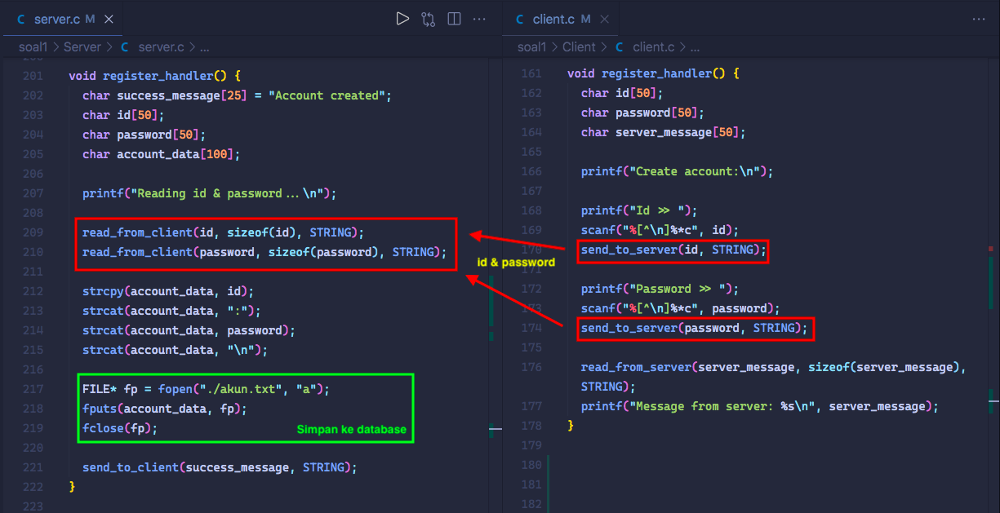

### Penjelasan:

1. Client input **id** dan **password**

2. Kirim **id** dan **password** ke server

3. Server mencatat **id** dan **password** ke file **akun.txt**

<br>

## **b. Database files.tsv & folder FILES**

- Pembuatan folder **FILES** telah dilakukan pada fungsi `main()` server yaitu dengan fungsi `mkdir()`.

- Pembuatan serta pencatatan **files.tsv** akan dilakukan bersamaan pada fitur **ADD** dan **DELETE** (lihat poin c dan poin e).

<br>

## **c. ADD file ke server**

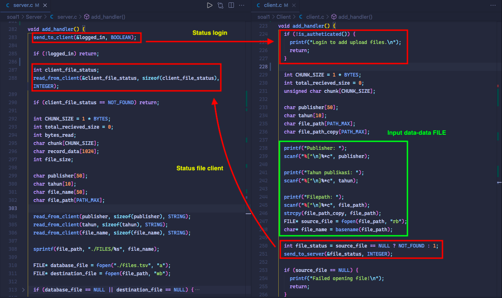

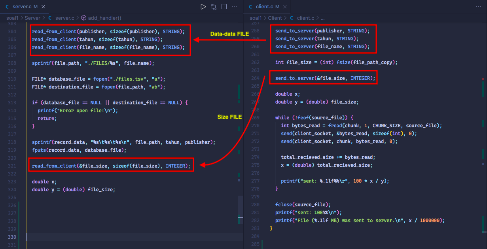

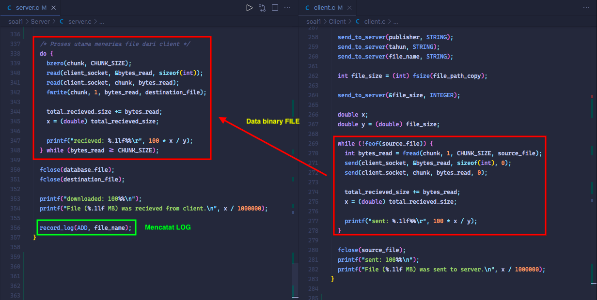

### Penjelasan:

1. Server mengirim status login kepada client, jika client belum login maka **request ADD** dibatalkan.

2. Client menginputkan data berupa:

   - Publisher
   - Tahun publishing
   - Filepath pada komputer client yang mengarah ke file yang ingin diupload

3. Client mengirim status apakah file tersebut ada / tidak. Jika tidak maka proses selesai.
4. Client mengirim informasi file (publisher, tahun, nama file) ke server
5. Client mengirim ukuran file ke server
6. Kirim file dengan teknik looping. Data yang dikirimkan adalah data binary. Teknik looping dibutuhkan karena data yang dikirimkan tidak bisa langsung sekaligus (misal 1GB), jadinya akan dikirim 1 Bytes lalu 1 Bytes lalu 1 Bytes... sampai selesai.
7. Server menerima potongan-potongan kecil data lalu menyimpannya kedalam folder **FILES**. Ini dilakukan hingga potongan-potongan tersebut selesai dikirim.
8. Server mencatat **LOG** untuk **ADD FILES**. Proses selesai.

> Lihat proses mencatat log pada **poin h**

<br>

## **d. DOWNLOAD file dari server ke client**

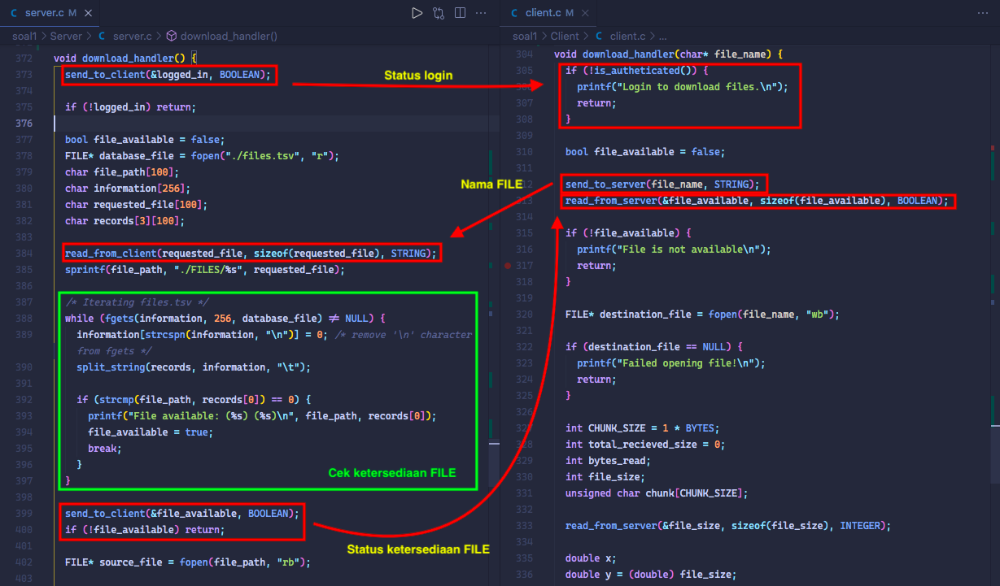

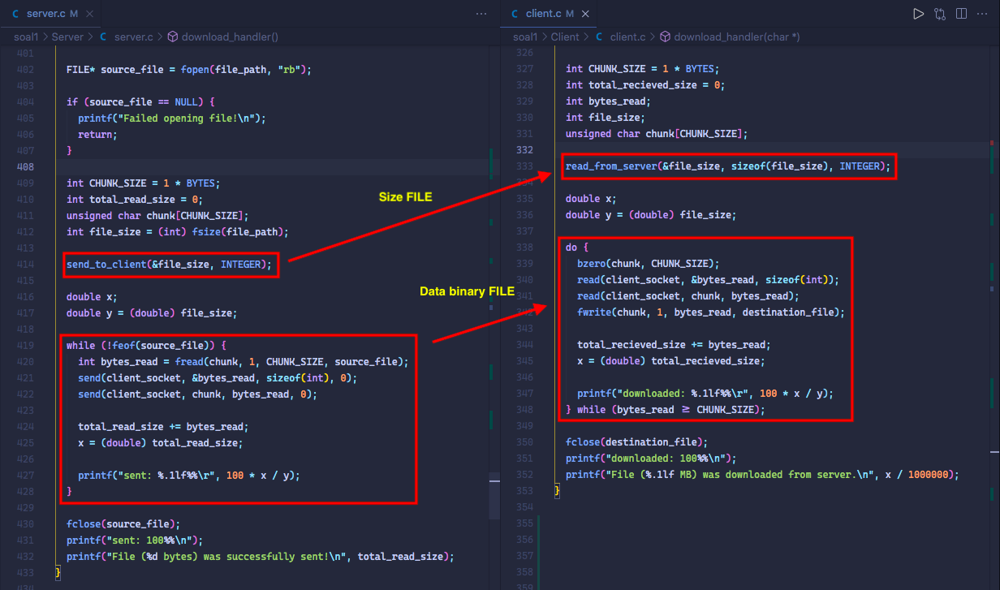

### Penjelasan:

1. Server mengirim status login kepada client, jika client belum login maka **request DOWNLOAD** dibatalkan.

2. Client mengirimkan nama file ke server.
3. Server melakukan pengecekan ketersediaan file yang diminta client dengan melihat pada **files.tsv**.
4. Server mengirim status ketersediaan file yang diminta client.
5. Server mengirim ukuran file yang diminta ke client
6. Kirim file dengan teknik looping. Data yang dikirimkan adalah data binary. Teknik looping dibutuhkan karena data yang dikirimkan tidak bisa langsung sekaligus (misal 1GB), jadinya akan dikirim 1 Bytes lalu 1 Bytes lalu 1 Bytes... sampai selesai.
7. Client menerima potongan-potongan kecil data lalu menyimpannya kedalam folder **Client**. Ini dilakukan hingga potongan-potongan tersebut selesai dikirim.
8. Proses selesai.

<br>

## **e. DELETE file pada server**

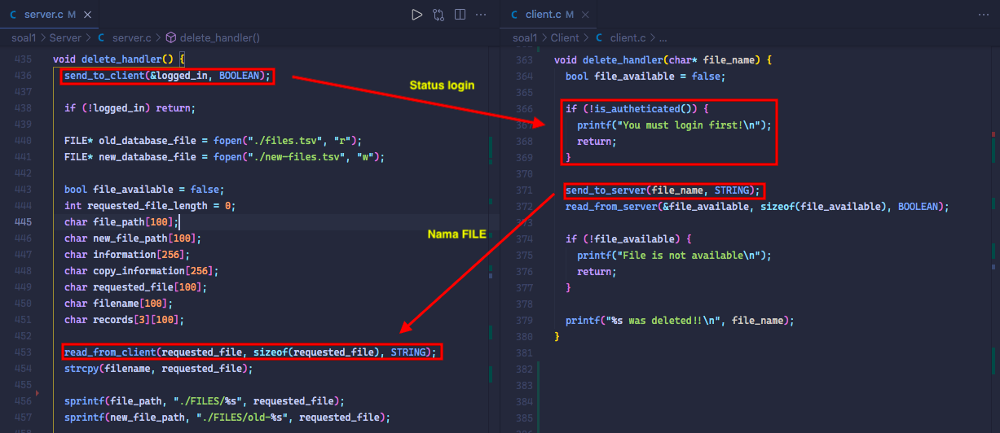

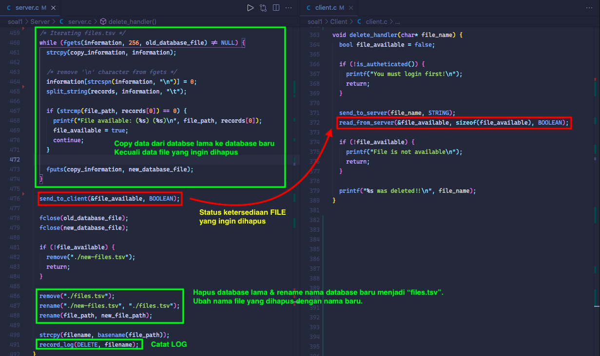

### Penjelasan:

Ide dari penghapusan baris pada database **files.tsv** adalah dengan membuat file database baru lalu meng-copy setiap baris pada database lama **kecuali** data file yang ingin dihapus. Jika file yang ingin dihapus itu ada, maka file database lama akan dihapus.

1. Server mengirim status login kepada client, jika client belum login maka **request DELETE** dibatalkan.

2. Client mengirimkan nama file yang ingin dihapus pada server
3. Server melakukan copy database dengan mengiterasi setiap baris pada **files.tsv**. Jika ditemukan data file yang ingin dihapus maka tidak akan dicopy ke database baru kemudian tandai bahwa file yang ingin dihapus itu ada.
4. Server mengirim status apakah file yang ingin dihapus ada atau tidak.
5. Jika file tidak ada, maka hapus database baru, proses selesai.
6. Hapus database lama
7. Server mencatat **LOG** untuk **DELETE FILES**. Proses selesai.

> Lihat proses mencatat log pada **poin h**

<br>

## **f. SEE file pada server**

## **g. FIND file pada server**

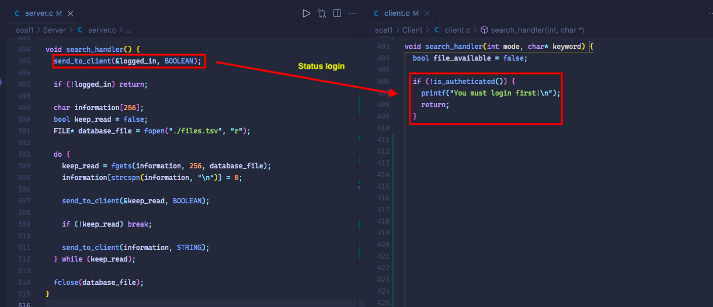

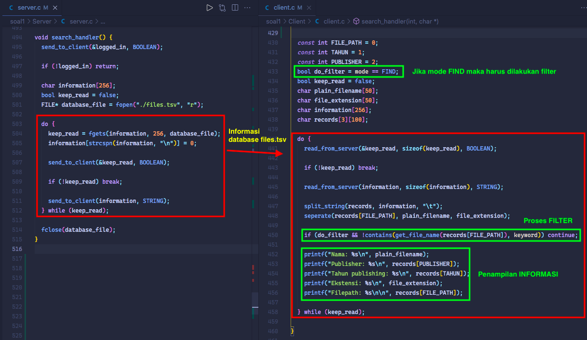

### Penjelasan:

Request **SEE** dan **FIND** sebenarnya bekerja hampir sama. Bedanya request **FIND** hanya menampilkan data nama files yang memiliki kesesuaian dengan keyword. Oleh karena itu akan dijelaskan sekaligus

1. Server mengirim status login kepada client, jika client belum login maka **request SEE** dibatalkan.

2. Jika request yang diterima adalah **FIND** maka variabel `do_filter` akan bernilai `true`. Artinya nanti saat sebelum menampilkan informasi ke client akan dicek terlebih dahulu apakah file mengandung keyword pencarian atau tidak. Jika tidak maka tidak akan ditampilkan.

3. Server mengirim setiap baris pada database **files.tsv** ke client dengan teknik looping.

4. Client menerima baris data lalu menentukan apakah perlu dilakukan filter atau tidak untuk keputusan penampilan informasi.

5. Tampilkan data pada client sesuai format pada soal

<br>

## **h. Pencatatan LOG**

- Pencatatan telah dilakuakan bersamaan untuk setiap request **ADD** dan **DELETE**.
- Hal tersebut dilakukan dengan fungsi `record_log(mode, nama_files)` [lihat fungsi disini](https://github.com/DewanggaDh/soal-shift-sisop-modul-3-F10-2021/blob/main/soal1/Server/server.c#L484)
- Pada dasarnya yang dilakukan adalah mencatat informasi berdasarkan mode kedalam file bernama **running.log**

<br><br>


# **Nomor 2**

a. Membuat program perkalian matrix (4x3 dengan 3x6) dan menampilkan hasilnya. Matriks nantinya akan berisi angka 1-20 (tidak perlu dibuat filter angka):
  ### **declare dan scan matriks**
      ```c++
        int (* arrays3)[6];
        int arrays1[4][3], arrays2[3][6];

        key_t key = 911;
        int shmid = shmget(key,sizeof(int[4][6]), IPC_CREAT | 0666); 
        arrays3 =  shmat(shmid,NULL,0);  
        int k=0, err;

        printf("Matriks 1:\n");
        for (int i=0; i<4; i++) {
            for (int j=0; j<3 ;j++) {
                scanf("%d", &arrays1[i][j]);
            }
        }
        printf("\nMatriks2:\n");
        for (int i=0; i<3; i++) {
            for (int j=0; j<6 ;j++) {
                scanf("%d", &arrays2[i][j]);
            }
        }
        while(k<6) {
            err = pthread_create(&(tid[k]), NULL, &multiplier, NULL); //pembuatan thread
            if(err != 0) {
                printf("Can't create thread : [%s]\n", strerror(err));
            } else {
                //printf("Crate thread success\n");
            }
            k++;
        }

        for (int i=0; i<6; i++) {
            pthread_join(tid[i], NULL);
        }
      ```

  ### **Fungsi perkalian 2 matriks**
      ```c++
        void *multiplier(void *arg) {
            pthread_t id = pthread_self();

            for(int x=0; x<6; x++){
                if(pthread_equal(id,tid[x])){
                    for (int i=0; i<4; i++) {
                        arrHasil[i][x] = 0;
                        for(int j=0; j<3; j++){
                            arrHasil[i][x] += arrays1[i][j]*arrays2[j][x];
                        }
                    }
                }
            }
        }
      ```

  ### **Print matriks dan kirim ke share memory untuk soal2b**
      ```c++
        for(int i=0; i<4; i++){
            for(int k=0; k<6; k++)
            {
                arrays3[i][k] = arrHasil[i][k];
                printf("%d ", arrays3[i][k]);
            }
            printf("\n");
        }
        shmdt(arrays3);
      ```

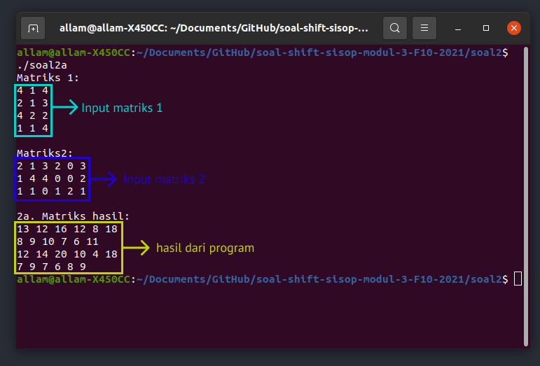

b. Membuat program dengan menggunakan matriks output dari program sebelumnya (program soal2a.c) (Catatan!: gunakan shared memory). Kemudian matriks tersebut akan dilakukan perhitungan dengan matrix baru (input user) sebagai berikut contoh perhitungan untuk matriks yang a	da. Perhitungannya adalah setiap cel yang berasal dari matriks A menjadi angka untuk faktorial, lalu cel dari matriks B menjadi batas maksimal faktorialnya matri(dari paling besar ke paling kecil) (Catatan!: gunakan thread untuk perhitungan di setiap cel). 
Ketentuan
- If a >= b  -> a!/(a-b)!
- If b > a -> a!
- If 0 -> 0

  ### **declare variables & get shared memory dari 2a**
  ```c++
    int const rows=4, cols=6;

    int (* arrays3)[6],size=1, size1=1, counter=0;
    long long arrHasil[4][6];
    long long new[4][6];
    int k=0, err;
    key_t key = 911;

    int shmid = shmget(key,sizeof(int[rows][cols]), IPC_CREAT | 0666); 
    arrays3 =  shmat(shmid,NULL,0);
  ```
  ### **input matriks baru lalu hitung**
  ```c++
    for (int row=0; row<rows; row++) {
        for (int col=0; col<cols; col++) {
            arrHasil[row][col] = arrays3[row][col];
            scanf("%lld", &new[row][col]);
        }
    }

    while (k<cols*rows) {
        err = pthread_create(&(tid[k]), NULL, &multiplier, NULL);
        if(err != 0){
            printf("Can't create thread : [%s]\n", strerror(err));
        }else{
            //printf("Crate thread success\n");
        }
        k++;
    }
  ```

  ### **fungsi penghitung faktorial**
  ```c++
    void *multiplier(void *arg)  {
        pthread_t id = pthread_self();
        for (int row=0; row<rows; row++) {
            for (int col=0; col<cols; col++) {
                if (pthread_equal(id, tid[row*cols+col])) {
                    if ((long long)arrays3[row][col] >= new[row][col]) {
                        long long batasAtas = arrays3[row][col], 
                                  batasBawah = arrays3[row][col] - new[row][col];
                        arrHasil[row][col] = batasAtas--;
                        for (long long factorial = batasAtas; factorial>batasBawah; factorial--) {
                            arrHasil[row][col] = arrHasil[row][col] * factorial;
                        }
                    } else if (arrays3[row][col] < new[row][col]) {
                        arrHasil[row][col] = (long long)arrays3[row][col];
                        for (long long factorial = (long long)arrays3[row][col]-1; factorial>0; factorial--) {
                            arrHasil[row][col] = arrHasil[row][col] * factorial;
                        }
                    } 
                    else if ((new[row][col]==0) || (arrays3[row][col]==0)) {
                        arrHasil[row][col] = 0;
                    }
                }
            }
        }
    }
  ```

  ### **print hasil**
  ```c++
    printf("\nMatriks factorial:\n");
    for (int row=0; row<rows; row++) {
        for (int col=0; col<cols; col++) {
            printf("%5lld ", arrHasil[row][col]);
        }
        printf("\n");
    }
  ```

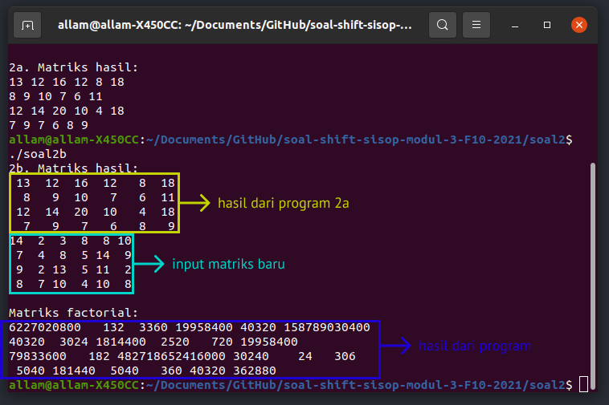

c. Karena takut lag dalam pengerjaannya membantu Loba, Crypto juga membuat program (soal2c.c) untuk mengecek 5 proses teratas apa saja yang memakan resource komputernya dengan command “ps aux | sort -nrk 3,3 | head -5” (Catatan!: Harus menggunakan IPC Pipes)

  ### **buat child beserta pipe**
  ```c++
    int p_1[2];
    int p_2[2];
    pid_t cpid1, cpid2, cpid3, status;
    if(pipe(p_1) == -1) {
        fprintf(stderr, "pipe failed");
        return 1;
    }
    if(pipe(p_2) == -1) {
        fprintf(stderr, "pipe failed");
        return 1;
    }

    cpid1 = fork();
    if (cpid1 < 0) fprintf(stderr, "fork failed");
    if (cpid1 == 0) {
        writePipe(p_1);

        char *argv1[] = {"ps", "aux", NULL};
        execv("/bin/ps", argv1);
    } 

    cpid2 = fork();
    if (cpid2 < 0) fprintf(stderr, "fork failed");
    if (cpid2 == 0) {
        readPipe(p_1);
        writePipe(p_2);

        char *argv1[] = {"sort", "-nrk", "3,3", NULL};
        execv("/bin/sort", argv1);
    }

     close(p_1[0]);
     close(p_1[1]);

    cpid3 = fork();
    if (cpid3 < 0) fprintf(stderr, "fork failed");
    if (cpid3 == 0) {
        readPipe(p_2);

        char *argv1[] = {"head", "-5", NULL};
        execv("/bin/head", argv1);
    }

     close(p_2[0]);
     close(p_2[1]);
  ```

  ### **fungsi read pipe dan write pipe**
  ```c++
    int writePipe (int *pipe) {
        close(pipe[0]);
        dup2(pipe[1], 1);
        close(pipe[1]);
        return 0;
    }

    int readPipe (int *pipe) {
        close(pipe[1]);
        dup2(pipe[0], 0);
        close(pipe[0]);
        return 0;
    }
  ```

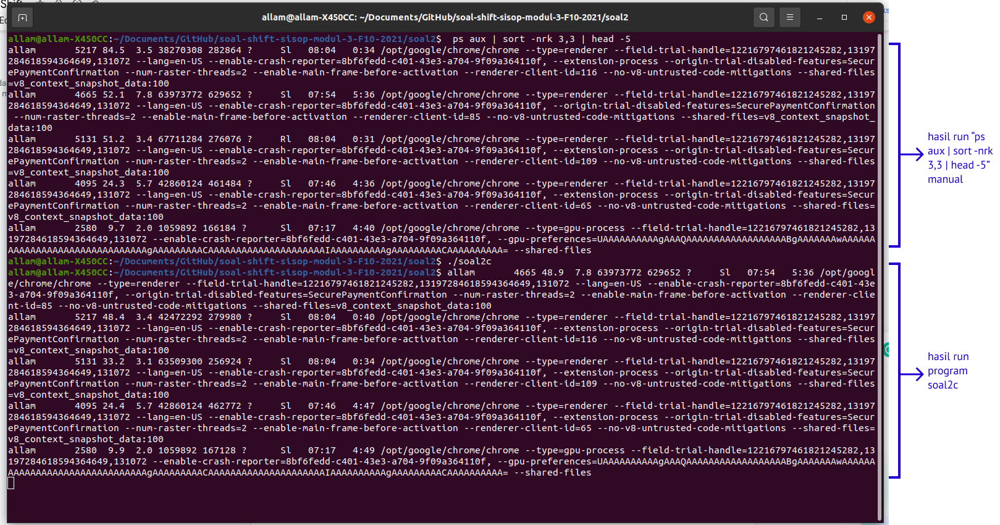

<br>